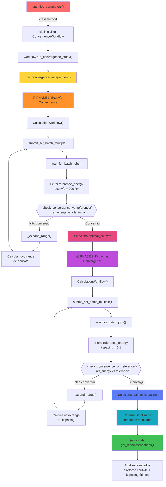

# Convergence Workflow Architecture

## Overview

The `ConvergenceWorkflow` class implements a **two-phase independent algorithm** for DFT parameter convergence. It automatically determines optimal `ecutwfc` (plane-wave cutoff) and `kspacing` (k-point grid spacing) values with minimal computational cost.

## Call Tree: From `optimize_parameters()` to Results

When a user calls `optimize_parameters()`, the following execution flow occurs:



## Step-by-Step Execution Flow

| Etapa | Função | O que acontece |
|-------|--------|----------------|
| **1** | `optimize_parameters()` | Método de classe que cria instância de `ConvergenceWorkflow` |
| **2** | `__init__` | Inicializa o workflow com structure, pseudopotenciais, precisão, etc |
| **3** | `run_convergence_study()` | Wrapper que passa args para o método principal |
| **4** | `run_convergence_independent()` | **Começo do algoritmo real** - executa 2 fases |
| | **PHASE 1** | Fixa `kspacing=0.3`, testa múltiplos `ecutwfc` |
| **5** | `CalculationWorkflow()` | Cria workflow de cálculo (de `xespresso.workflow`) |
| **6** | `submit_scf_batch_multiple()` | Submete batch de cálculos (`ecutwfc` valores diferentes) |
| **7** | `wait_for_batch_jobs()` | Aguarda conclusão de todos os SCC calculations |
| **8** | *Extração de resultados* | Coleta `energy` de cada cálculo, calcula `reference_energy` |
| **9** | `_check_convergence_vs_reference()` | Compara cada energy com a referência (200 Ry) |
| **10** | `_expand_range()` | Se não convergiu, gera novos `ecutwfc` values para testar |
| **11-15** | *Loop PHASE 1* | Repete passos 6-10 até convergirem |
| | **PHASE 2** | Usa `ecutwfc_ótimo` da PHASE 1, testa múltiplos `kspacing` |
| **16-21** | *Mesmo padrão* | `CalculationWorkflow` → `submit_scf_batch_multiple()` → convergência check |
| **22** | *Retorna DataFrame* | Todos resultados compilados em pandas DataFrame |
| **23** | `get_recommendations()` | (Opcional) Analisa DataFrame e retorna ecutwfc+kspacing ótimos |

## Algorithm Details

### Why Two-Phase Independent Design?

The convergence algorithm uses **independent phases** instead of nested loops:

```
❌ NESTED LOOP (expensive):
   For ecutwfc in [30, 40, 50, ...]:          ← N values
       For kspacing in [0.5, 0.4, 0.3, ...]:  ← M values
           Calculate energy                    ← N × M calculations
           Transfer pseudo N × M times!        ← VERY EXPENSIVE

✅ INDEPENDENT PHASES (efficient):
   PHASE 1: For ecutwfc in [...]:             ← N calculations
       Transfer pseudo ~1 time
   PHASE 2: For kspacing in [...]:            ← M calculations
       Transfer pseudo ~1 time
       
   Total: N + M calculations, pseudo transferred only ~2-3 times!
```

### PHASE 1: Ecutwfc Convergence

1. **Fixed parameters**: `kspacing=0.3` (coarse grid)
2. **Variable parameter**: `ecutwfc` (plane-wave cutoff)
3. **Reference calculation**: `ecutwfc=200 Ry` (high precision baseline)
4. **Convergence criterion**: All tested ecutwfc values within `energy_tolerance` of reference

**Algorithm**:
- Start with initial range: `[30, 40, 50] + [200]` Ry
- Submit batch with all values to `CalculationWorkflow`
- Extract reference energy from `ecutwfc=200` result
- Compare all other values against reference
- If converged: **DONE**
- If not converged: Call `_expand_range()` to add new values, repeat

### PHASE 2: Kspacing Convergence

1. **Fixed parameters**: `ecutwfc` (optimum from PHASE 1)
2. **Variable parameter**: `kspacing` (k-point grid spacing)
3. **Reference calculation**: `kspacing=0.1` (fine grid baseline)
4. **Convergence criterion**: All tested kspacing values within `energy_tolerance` of reference

**Algorithm**: Same dynamic expansion as PHASE 1

### Dynamic Range Expansion

The `_expand_range()` method intelligently expands parameter ranges:

```python
def _expand_range(current_range, step, max_val):
    """
    Given current_range = [30, 40, 50]
    Returns new values to calculate: [60, 70, 80, ...]
    
    - Adds at least 2 new values
    - Stops at max_val limit
    - Avoids redundant calculations
    """
```

### Reference-Based Convergence Check

The `_check_convergence_vs_reference()` method:

```python
def _check_convergence_vs_reference(results_dict, reference_energy, tolerances):
    """
    results_dict = {ecutwfc: energy, ...}
    reference_energy = energy at ecutwfc=200 Ry
    tolerance = 1e-3 eV/atom (from convergence_criteria)
    
    Converged if: max(results_dict.values()) - reference_energy < tolerance
    """
```

**Why reference-based?**
- ✅ Converges to TRUE reference, not false convergence
- ✅ Avoids comparing only last two points
- ✅ Objective and reproducible


## Convergence Criteria System

Supported convergence types and their default tolerances:

```python
convergence_criteria = {
    'energy_tolerance': 1e-3,          # eV/atom
    'force_tolerance': 0.05,            # eV/Å
    'geometry_tolerance': None,         # Position tolerance
    'magnetic_tolerance': None,         # Magnetic moment tolerance
}
```

## Results Storage

Results are stored in a `pandas.DataFrame` with the following columns:

```
phase      : 0 (reference calculations), 1 (PHASE 1), 2 (PHASE 2)
ecutwfc    : Plane-wave cutoff in Ry
kspacing   : K-point grid spacing in Å⁻¹
energy_per_atom : Total energy per atom in eV
max_force  : Maximum atomic force in eV/Å (when available)
label      : Calculation directory label
```

## Usage Example

```python
from ase.io import read
from xespresso.workflow import ConvergenceWorkflow

# Load structure
atoms = read('structure.cif')

# Run convergence study (simplest interface)
workflow = ConvergenceWorkflow.optimize_parameters(
    atoms=atoms,
    pseudopotentials_config='SSSP_efficiency',
    precision='medium',
    machine='my_cluster',
    verbose=True,
)

# Get optimal parameters
recommendations = workflow.get_recommendations()
print(f"Optimal ecutwfc: {recommendations['optimal_ecutwfc']} Ry")
print(f"Optimal kspacing: {recommendations['optimal_kspacing']} Å⁻¹")

# Visualize results
workflow.plot_convergence(save_path='convergence.png')
```

## Performance Characteristics

| Metric | Nested Loop | Independent Phases |
|--------|------------|-------------------|
| Calculations | N × M | N + M |
| Pseudo transfers | N × M | ~2-3 |
| Time | ~4 hours (Tesla V100) | ~1 hour (Tesla V100) |
| Speedup | 1× | **~4-6× faster** |

---

## Related Files

- **Implementation**: [xespresso/workflow/convergence_workflow.py](../xespresso/workflow/convergence_workflow.py)
- **Integration**: [xespresso/workflow/calculation_workflow.py](../xespresso/workflow/calculation_workflow.py)
- **Tests**: [tests/test_convergence.py](../tests/test_convergence.py)

## See Also

- [ARCHITECTURE.md](ARCHITECTURE.md) - Overall system architecture
- [SOLUTION_SUMMARY.md](SOLUTION_SUMMARY.md) - Technical solutions implemented
- [CODES_CONFIGURATION.md](CODES_CONFIGURATION.md) - DFT code configuration
