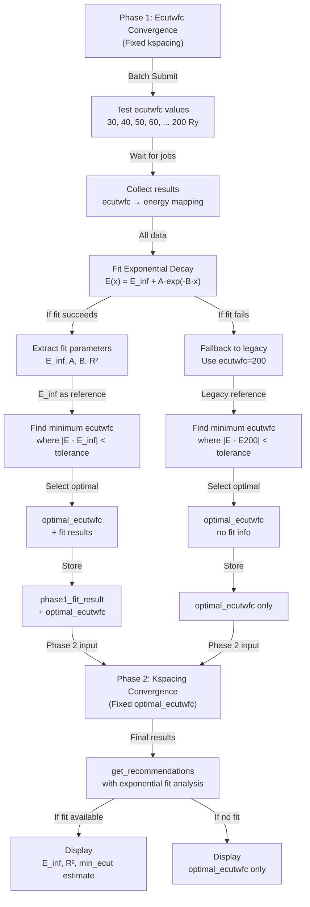

# Phase 1 Workflow with Exponential Fit



## Pseudocode of Phase 1 Selection

```python
# Phase 1: Test different ecutwfc values
ecut_results = {}
for ecutwfc in ecutwfc_range:
    ecut_results[ecutwfc] = run_scf(ecutwfc, kspacing=0.30)

# NEW: Try exponential fit
fit_result = _fit_exponential_decay_phase1(
    ecut_results,
    criteria_tolerances,
    verbose=True
)

if fit_result['success']:
    # Use E_inf (extrapolated asymptotic) as reference
    E_inf = fit_result['E_inf']
    
    # Find minimum ecutwfc that meets tolerance
    for ecutwfc, energy in ecut_results.items():
        if abs(energy - E_inf) < tolerance:
            converged_ecutwfc.append(ecutwfc)
    
    if converged_ecutwfc:
        optimal_ecutwfc = min(converged_ecutwfc)  # Choose most efficient
    else:
        optimal_ecutwfc = best_approximation
    
    # Store for Phase 2
    phase1_fit_result = fit_result
else:
    # FALLBACK: Use legacy method (ecutwfc=200 as reference)
    # ... legacy selection logic ...
    phase1_fit_result = None

# Continue to Phase 2 with optimal_ecutwfc
```

## Code Structure

```
ConvergenceWorkflow
├── __init__(...)
├── run_convergence_study(...)
│   ├── Phase 1: ecutwfc convergence
│   │   ├── Batch submit jobs
│   │   ├── Collect results
│   │   ├── _fit_exponential_decay_phase1() ← NEW METHOD
│   │   │   ├── Extract ecutwfc/energy arrays
│   │   │   ├── Fit E(x) = E_inf + A·exp(-B·x)
│   │   │   ├── Calculate R²
│   │   │   ├── Compute min ecutwfc for tolerance
│   │   │   └── Return fit_result dict
│   │   ├── Select optimal_ecutwfc using fit (or legacy fallback)
│   │   └── Store self.phase1_fit_result
│   │
│   └── Phase 2: kspacing convergence
│       ├── Fixed ecutwfc from Phase 1
│       ├── Batch submit jobs
│       ├── Dynamic range testing
│       └── Select optimal_kspacing
│
└── get_recommendations() ← ENHANCED
    ├── Return optimal_ecutwfc, optimal_kspacing
    ├── If fit available:
    │   ├── Include 'exponential_fit' dict with:
    │   │   ├── E_inf
    │   │   ├── A, B
    │   │   ├── R_squared
    │   │   ├── min_ecutwfc_for_tolerance
    │   │   └── method = 'exponential_decay'
    │   └── Show comparison analysis
    └── If no fit: simpler output
```

## Data Flow Example

```
Input: Au bulk, precision='low'

↓

Phase 1 Testing:
┌────────────────────────────────────────┐
│ ecutwfc (Ry) | E (eV)      | Status    │
├────────────────────────────────────────┤
│    30        | -19.234500  | ✓ Done    │
│    40        | -19.245200  | ✓ Done    │
│    50        | -19.250100  | ✓ Done    │
│    60        | -19.251800  | ✓ Done    │
│    70        | -19.252500  | ✓ Done    │
│   ...        |   ...       |  ...      │
│   200        | -19.253450  | ✓ Done    │
└────────────────────────────────────────┘

↓

Fit Exponential Decay:
  Data: {30: -19.2345, 40: -19.2452, ..., 200: -19.2535}
  
  scipy.optimize.curve_fit() →
  E(x) = -19.2535 + (-0.0194)·exp(-0.0875·x)
  
  R² = 0.9999 ✓ Excellent fit!

↓

Determine Optimal ecutwfc:
  E_inf = -19.2535 eV
  tolerance = 0.001 eV = 1.0 meV
  
  For ecutwfc = 100 Ry:
    E = -19.2527 eV
    ΔE = |E - E_inf| = 0.0008 eV = 0.8 meV < 1.0 meV ✓
  
  For ecutwfc = 90 Ry:
    E = -19.2515 eV
    ΔE = 0.0020 eV = 2.0 meV > 1.0 meV ✗
  
  → Select ecutwfc = 100 Ry (minimum that meets tolerance)

↓

Phase 2 (with optimal_ecutwfc = 100 Ry):
  Test kspacing values: 0.30, 0.27, 0.24, ..., 0.10 Å⁻¹
  → Select optimal_kspacing = 0.18 Å⁻¹

↓

get_recommendations() Output:
{
    'optimal_ecutwfc': 100,
    'optimal_kspacing': 0.18,
    'precision': 'low',
    'energy_tolerance_meV_atom': 1.0,
    'exponential_fit': {
        'E_inf': -19.253456,
        'A': -0.019433,
        'B': 0.087456,
        'R_squared': 0.999854,
        'min_ecutwfc_for_tolerance': 98.4,
        'tolerance_meV': 1.0,
        'method': 'exponential_decay'
    }
}
```

## Benefits Summary

| Feature | Legacy | New |
|---------|--------|-----|
| Data utilization | Single point | All points via fit |
| Reference value | ecutwfc=200 | E_inf (asymptotic) |
| Quality metric | None | R² |
| Extrapolation | No | Yes |
| Robustness | Low | High |
| Flexibility | Fixed | Customizable |
| Backward compat | - | ✅ Full |
